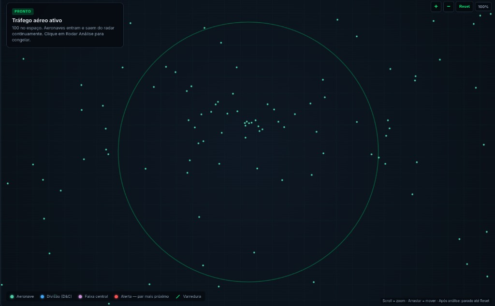
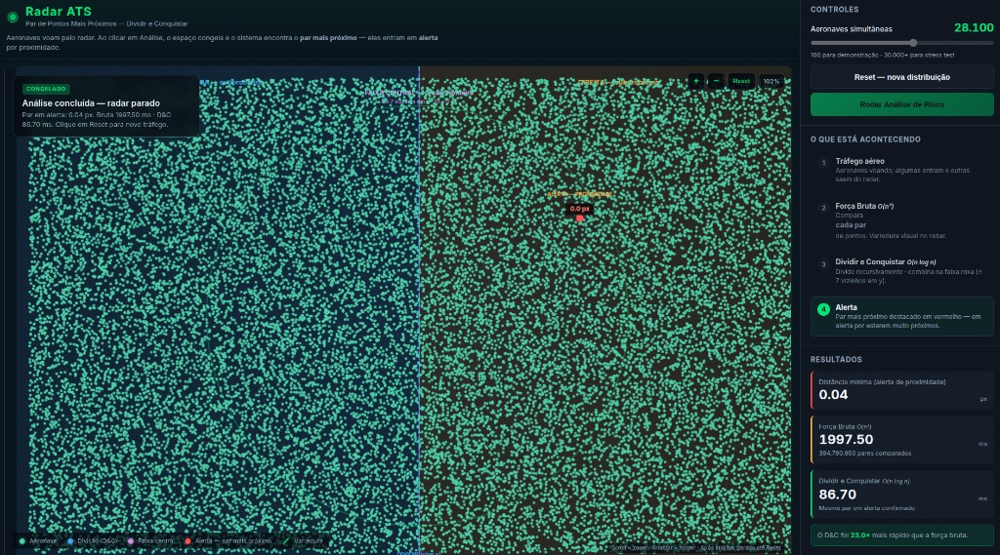
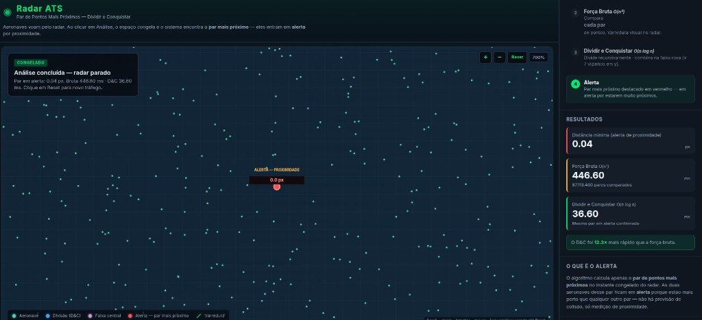

# RADAR ATS (DIVIDIR E CONQUISTAR)

Número da Lista: 16<br>
Conteúdo da Disciplina: Projeto de Algoritmos (par de pontos mais próximos — dividir e conquistar)<br>

## Alunos

| Matrícula   | Aluno                        |
| ----------- | ---------------------------- |
| 24/2015773  | Caio Breno de Souza Bezerra  |
| 24/2015138  | Bruno Ferreira Dornelas      |

## Sobre

O **Radar ATS** é uma aplicação web que simula um **radar de controle aéreo** no plano cartesiano: cada aeronave é um **ponto `(x, y)`** no canvas. Ao congelar o tráfego, o sistema resolve o problema clássico do **par de pontos mais próximos** — encontra as duas aeronaves com **menor distância euclidiana** no instante capturado e as coloca em **alerta de proximidade** (sem previsão de colisão, apenas medição geométrica).

O projeto tem dois focos pedagógicos e práticos:

1. **Força Bruta `O(n²)`** — Compara **todos os pares** `(i, j)` de aeronaves congeladas, usando distância ao quadrado para evitar `sqrt` desnecessários. O resultado aparece no painel (distância em px, tempo em ms) e o par mais próximo é destacado em **vermelho** no radar, com animação de varredura durante a etapa didática.
2. **Dividir e Conquistar `O(n log n)`** — Ordena os pontos por `x` e por `y`, divide o plano ao meio, resolve **recursivamente** cada metade e combina checando só a **faixa central** de largura `2δ` (δ = menor distância já encontrada nas metades). Na faixa, cada ponto compara com no máximo **7 vizinhos seguintes em y**, garantindo complexidade linear no merge. A visualização mostra a **linha azul de corte**, as regiões esquerda/direita, a **faixa roxa** e confirma o mesmo par em alerta.

Antes da análise, as aeronaves **voam** pelo radar (entram pelas bordas e saem). Ao clicar em **Rodar Análise de Risco**, o espaço aéreo **congela**: as posições são copiadas para `ax`/`ay` e os algoritmos operam sobre esse instante fixo. É possível ajustar a quantidade de aeronaves (100 a 50.000), usar **zoom** (scroll ou botões) e **pan** (arrastar), e comparar tempos entre força bruta e D&C — com dezenas de milhares de pontos a vantagem assintótica do D&C fica evidente.

A aplicação é **100% client-side**: JavaScript puro, **HTML5 Canvas** para o radar e **CSS** para o painel de controle. Toda a lógica — tráfego, algoritmos, animações e interface — está em `main.js`; o layout em `index.html`; os estilos em `style.css`.

## Screenshots

| Radar — tráfego aéreo ativo | Visão geral da aplicação |
| :---: | :---: |
|  |  |

| Comparação Força Bruta × D&C (tempos em ms) |
| :---: |
|  |

## Instalação

**Linguagem:** JavaScript (script clássico), HTML5, CSS3<br>
**Framework:** não há framework de interface (aplicação estática). **Bibliotecas externas:** nenhuma — renderização via `<canvas>` nativo; execução inteiramente no navegador.

**Pré-requisitos**

- Navegador atualizado (Chrome, Firefox, Edge ou equivalente).
- **Node.js** (opcional): apenas se quiser servir os arquivos por HTTP.

**Comandos**

Como o projeto não usa módulos ES, a forma mais simples é abrir o `index.html` diretamente no navegador (duplo clique).

**Alternativa com servidor estático:**

```bash
cd G16_Dividir-e-Conquistar_PA-26.1
python3 -m http.server 8080
```

Abra no navegador: `http://localhost:8080`.

**Alternativa com Node (mesmo padrão do Amazon Express):**

```bash
cd G16_Dividir-e-Conquistar_PA-26.1
npx --yes serve -l 3000 .
```

Abra no navegador: `http://localhost:3000`.

## Uso

1. **Tráfego aéreo:** ajuste o slider **Aeronaves simultâneas** (100 para demonstração; 30.000+ para stress test). Use **Reset — nova distribuição** para gerar outra configuração de pontos.
2. **Análise:** clique em **Rodar Análise de Risco**. O radar congela; o fluxo percorre força bruta → D&C → alerta. Confira no painel a **distância mínima (px)** e os **tempos (ms)** de cada algoritmo.
3. **Visualização D&C:** observe a linha azul (corte), as metades coloridas e a faixa roxa (`2δ`). O par mais próximo fica em **vermelho** — alerta de proximidade.
4. **Zoom e navegação:** scroll ou botões **+/−** para zoom; **arrastar** o canvas para mover a visão; **Reset** no zoom restaura 100%.
5. **Comparar performance:** com ~100 aeronaves os tempos podem ser parecidos (overhead do D&C); com **30.000–50.000** a força bruta demora segundos e o D&C responde em poucos ms — o badge “X× mais rápido” aparece quando o D&C supera a bruta em pelo menos 5%.

## Outros

- **Vídeo da apresentação:** [YouTube — apresentação do projeto](https://youtu.be/ygvwNubpoMY)
- Estrutura útil do repositório: `index.html`, `style.css`, `main.js`, `assets/` (capturas de tela para o README).
- Funções principais dos algoritmos em `main.js`: `forcaBruta`, `dividirConquistar`, `dividirConquistarRec`, `faixaCentral`, `particionarListasY`, `rodarAnalise`.
